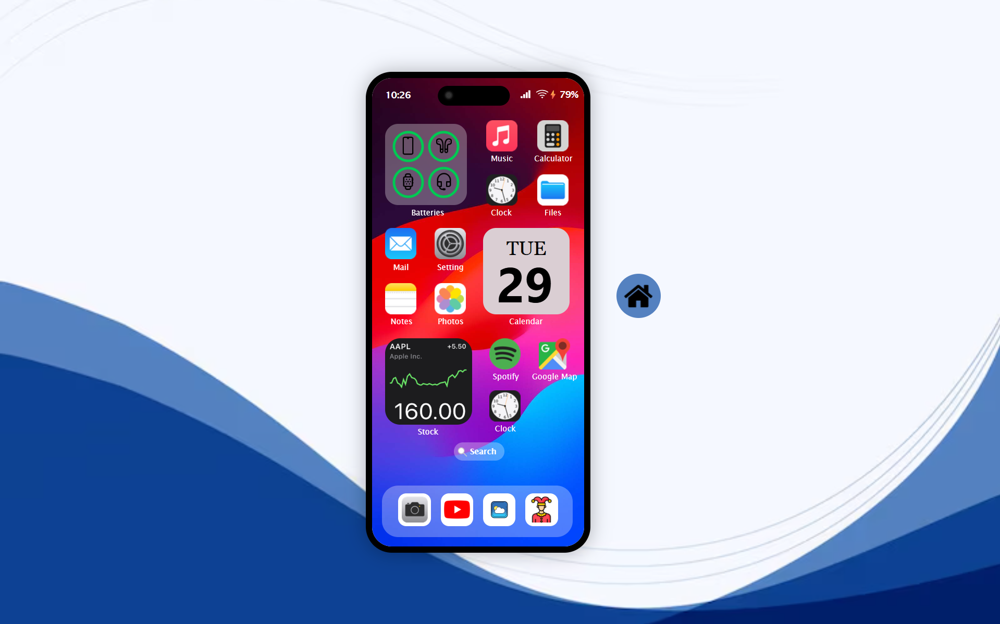

# 📱 Mobile Dashboard Simulator



An interactive mobile UI simulation that replicates a smartphone home screen experience. This project includes custom widgets, app icons, live clock, and transitions — all designed to mimic the look and feel of a modern mobile dashboard.

---

## Table of Contents
- [Features](#features)
- [Installation](#installation)
- [API Used](#api-used)
- [Tech Stack](#tech-stack)
- [Project Structure](#project-structure)
- [Website Link](#website-link)

---

## Features

- 📱 **Mobile UI Simulation**:
  - Realistic smartphone frame with notch and camera
  - Multiple widgets (clock, notes, calendar, weather, battery)
  - Custom dock with app icons (Phone, Messages, Music, Browser)

- ⏰ **Live Clock Widget**:
  - Displays current system time in real time
  - Central screen focus for easy visibility

- 📷 **Gallery & App Transitions**:
  - Launch individual app screens (e.g., Notes, Calculator, Settings)
  - Gallery view to browse sample images
  - Smooth transitions and animations for app interaction

---

## Installation

1.  Clone the repository:
    ```bash
    git clone https://github.com/asmath-akbar-ali/Mobile-Dashboard-Simulator.git 
    ```
2.  Navigate to the project folder:
    ```bash
    cd Mobile-Dashboard-Simulator
    ```
3.  Open `index.html` in your browser.

---

## API Used

-   **Browser APIs**:
    -   **Battery Status API**: `navigator.getBattery()` for real-time battery info.
    -   **Geolocation API**: For interactive maps.
    -   **Media Devices API**: `navigator.mediaDevices.getUserMedia()` to access the camera.
    -   **Local Storage API**: `localStorage` for saving Notes data.
    -   **Navigator & Screen APIs**: `navigator.*` and `screen.*` for system information in Settings.
    -   **Date() Object**: For live clock, calendar, and time formatting.

-   **Libraries/Plugins**:
    -   **Leaflet.js** + **Leaflet Control Geocoder**: Powers the interactive map with search.

-   **External Data/Embeds**:
    -   **Picsum Photos API**: `https://picsum.photos` for random images in the Photo Gallery.
    -   **Spotify Embed API**: Integrates Spotify player functionality.
    -   **Joke Web App**: Embeds a joke generator.
    -   **Weather Web App**: Embeds a weather application.
---

## Tech Stack
-   **HTML5** — UI structure and layout
-   **CSS3** — Styling, responsiveness, widget design, animations
-   **JavaScript (ES6)** — App logic, time updates, UI interactivity

---

## Project Structure

```bash
mobile-ui-homescreen/
├── index.html
├── style.css
├── script.js
├── images
```
---

## Website Link
